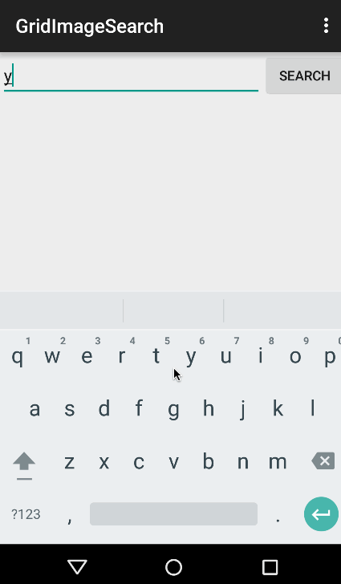

# [Android Bootcamp] Project 2: Grid Image Search

User Stories:

Basic Requirements:
 * [x] enter a search query that will display a grid of image results from the Google Image API.
 * [x] click on "settings" which allows selection of advanced search options to filter results
 * [x] configure advanced search filters such as:
       * Size (small, medium, large, extra-large)
       * Color filter (black, blue, brown, gray, green, etc...)
       * Type (faces, photo, clip art, line art)
       * Site (espn.com)
 * [x] Subsequent searches will have any filters applied to the search results
 * [x] tap on any image in results to see the image full-screen
 * [x] scroll down “infinitely” to continue loading more image results (up to 8 pages)

Optional Requirements:
 * [ ] Robust error handling, check if internet is available, handle error cases, network failures
 * [x] Use the ActionBar SearchView or custom layout as the query box instead of an EditText
 * [ ] User can share an image to their friends or email it to themselves
 * [x] Replace Filter Settings Activity with a lightweight modal overlay
 * [x] Improve the user interface and experiment with image assets and/or styling and coloring
 * [x] Use the StaggeredGridView to display improve the grid of image results
 * [ ] User can zoom or pan images displayed in full-screen detail view

Walkthrough of user stories:

